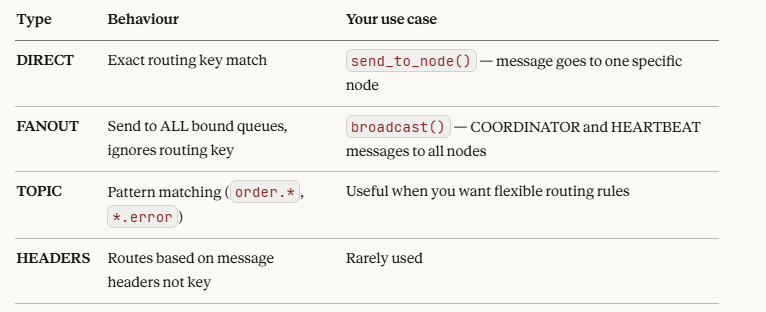
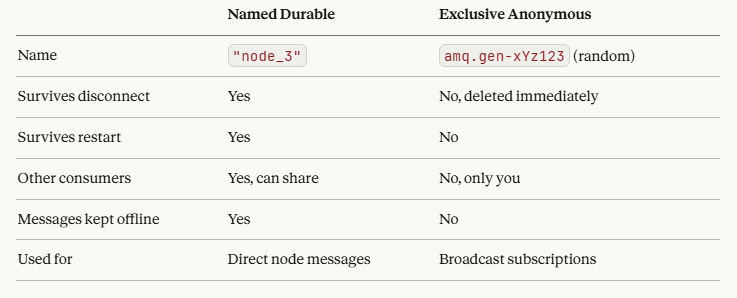

Connection = a phone call to RabbitMQ
Channel    = a conversation happening inside that call

You can have many channels over one connection. You have _write_channel specifically for publishing/sending messages and _read_channel for consuming.


Model 
Your App → Exchange → Queue → Consumer 
not 
Your App → Queue → Consumer

Exchange = The sorting facility at the post office. This is not a queue
Queue    = The actual mailbox at someone's house

The difference
A queue stores messages. It holds them, keeps them safe, and waits for a consumer to come pick them up. Messages sit in a queue until someone reads them.
An exchange stores nothing. Ever. It receives a message, makes a routing decision instantly, forwards it to the right queue, and forgets about it. If no queue is bound to it, the message is just dropped and gone forever.


The 4 Exchange Types



why are we declaring a exchange in the write and not the read

Write channel = you are the PRODUCER   → you own the exchange
Read channel  = you are the CONSUMER   → you own the queues


Why do we bind queue to exchange  await queue.bind(self._exchange, routing_key=queue_name)


The problem without binding
Right now you have two separate things that don't know about each other:
Exchange        Queue
────────        ─────
app_exchange    node_3
The exchange has no idea the node_3 queue exists. The queue has no idea the exchange exists. They are completely isolated. If you publish a message to the exchange with routing_key="node_3", the exchange looks around, finds nothing bound to that key, and drops the message forever.

What binding does
Binding is simply telling the exchange:

"When you receive a message with routing key node_3, you should forward it to the node_3 queue."

After binding:
Exchange                    Queue
────────                    ─────
app_exchange  ──────────▶   node_3
          routing_key
           = "node_3"
Now the exchange knows exactly where to send it.


connect_robust gives you automatic reconnection if the network drops. You don't have to write retry logic yourself.
prefetch_count=1 on the read channel means RabbitMQ only sends one message at a time to your consumer. It waits for an acknowledgement before sending the next one. This prevents your consumer from being overwhelmed.
DeliveryMode.PERSISTENT on messages means they are written to disk. If RabbitMQ restarts before a message is consumed it won't be lost.
message.process() context manager automatically sends ACK if your handler succeeds and NACK if it throws an exception. ACK tells RabbitMQ to delete the message. NACK tells RabbitMQ to put it back in the queue.


When working with queues

Your code calls send_to_queue("orders", {"id": 1})
    → Message is JSON encoded and wrapped
    → Published to app_exchange with routing_key="orders"
    → Exchange looks up which queue is bound to "orders"
    → Message is delivered to the "orders" queue
    → RabbitMQ holds it there

Your code calls consume_from_queue("orders", handle_order)
    → Queue is declared and bound to exchange
    → _handle is registered as the listener
    → When a message arrives, _handle is called automatically
    → Message bytes are decoded back to a dict
    → Your handle_order function is called with the dict
    → If it succeeds, ACK is sent, message deleted from queue
    → If it fails, NACK is sent, message goes back to queue


Reading queue
declare_queue(queue_name, durable=True)  # permanent, has a name, survives everything
declare_queue(exclusive=True)            # temporary, no name, dies when you disconnect


## Think of it like this

**Named durable queue** is like a **mailbox outside your house**:
```
- Has your address (name) on it
- Exists permanently
- Mail sits in it even when you're not home
- Anyone who knows your address can send to it
```

**Exclusive anonymous queue** is like a **phone call**:
```
- No permanent address
- Only exists while you're connected
- When you hang up it's gone
- No one else can join your call





Why is subscribes to broadcast need the this queue 
queue = await self._read_channel.declare_queue(exclusive=True)
where the  subscribes to queue is perment


ELECTION and OK messages must survive — they are instructions that drive the algorithm. HEARTBEAT and COORDINATOR messages are only relevant in the present moment — a stale heartbeat is worse than no heartbeat because it gives you false information about the current state of the system.


Named Durable Queue
queue = await self._read_channel.declare_queue(queue_name, durable=True)
```

- Has a **name** like `node_3`
- **Survives** RabbitMQ restarts
- **Survives** your app disconnecting and reconnecting
- Messages sitting in it are **not lost** when your consumer goes offline
- Multiple consumers can connect to the same queue by name
- Used for **direct node-to-node messages** in your bully algorithm
```
node_3 queue
├── msg  (waits here even if node_3 is offline)
├── msg
└── msg


Exclusive Anonymous Queue
queue = await self._read_channel.declare_queue(exclusive=True)
```

- Has **no name** — RabbitMQ generates a random one like `amq.gen-xYz123`
- **Dies** the moment your consumer disconnects
- **Exclusive** means only this one connection can use it — no other consumer can attach to it
- Used for **broadcast subscriptions** — each node gets its own temporary private queue bound to the fanout exchange
- When the node dies, the queue dies with it and RabbitMQ cleans it up automatically
```
node_3 connects → RabbitMQ creates amq.gen-xYz123
node_3 dies     → RabbitMQ deletes amq.gen-xYz123 automatically
node_3 restarts → RabbitMQ creates amq.gen-abc456 (brand new queue)
```

---

## Why the difference matters for your bully algorithm
```
Direct messages  → named durable queue
                   node must receive ELECTION/OK messages even if briefly offline
                   messages must not be lost

Broadcast        → exclusive anonymous queue  
                   HEARTBEAT and COORDINATOR are only useful RIGHT NOW
                   a node that was offline doesn't need old heartbeats from 5 minutes ago
                   when it reconnects it gets a fresh queue and listens from that point on